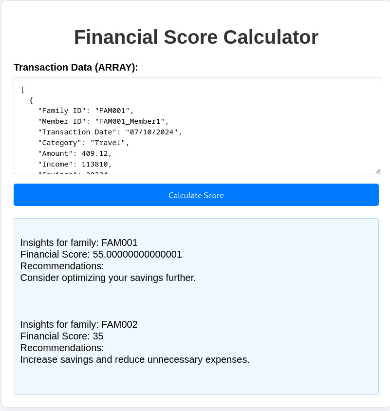

<H1>Fraud Detection Model Development </H1>
<h2>Introduction</h2>

This notebook focuses on building a fraud detection model using machine learning techniques. The objective is to preprocess a financial dataset, train predictive models, and evaluate their performance to identify fraudulent transactions.

<h2>Sections Overview</h2>

<ul>
  <ol>
    <b>1. Data Loading</b>
Description: Load the financial dataset from a CSV file.
Key Functions:
pd.read_csv(): Reads the data from the specified path.
  </ol>
   
  <ol>
    <b>2. Data Exploration</b>
Description: Explore the dataset to understand its structure and identify potential issues like missing values.
Key Steps:
Overview of columns, data types, and summary statistics.
Identify missing values using df.isnull().sum().
  </ol>
   
  <ol>
    <b>3. Data Preprocessing</b>
Description: Clean and prepare the dataset for model training.
Key Techniques:
Impute missing values using the median to avoid outliers.
Handle categorical variables through encoding techniques.
Normalize numerical features for uniform scaling.
  </ol>
   
  <ol>
<b>4. Feature Selection</b>
Description: Select the most relevant features for the model.
Key Techniques:
Correlation analysis using df.corr().
Feature importance using tree-based models.
    
  </ol>
   
  <ol>
    <b>5. Model Development</b>
Description: Build and train machine learning models.
Algorithms Used:
Logistic Regression
Decision Trees
Random Forest
Gradient Boosting Machines (e.g., XGBoost)
Key Libraries:
scikit-learn
xgboost
  </ol>
   
  <ol>
    
<b>6. Model Evaluation<b>
Description: Evaluate model performance using metrics like:
Accuracy
Precision
Recall
F1-score
ROC-AUC score
Key Functions:
classification_report()
roc_curve()
auc()
  </ol>
   
  <ol>
    <b>7. Hyperparameter Tuning</b>
Description: Optimize model parameters for better performance.
Key Techniques:
Grid Search
Randomized Search
  </ol>
   
  <ol>
    <b>8. Results Visualization</b>
Description: Visualize key insights using plots for:
Feature importance
Confusion matrix
ROC curve
  </ol>
   
  <ol>
    <b>9. Deployment</b>
Description: Export the final model for deployment.
Key Steps:
Save the trained model using joblib or pickle.
Prerequisites
Libraries Used:
pandas: Data manipulation
numpy: Numerical computations
matplotlib, seaborn: Visualization
scikit-learn: Machine learning models and utilities
xgboost: Gradient boosting algorithms
System Requirements:
Python 3.x
Adequate memory for handling large datasets
  </ol>
</ul>

<h1>API Documentation for Financial Insights and Scoring</h1>
<h2>Overview</h2>

This API is built using Flask to expose the financial scoring model. It accepts financial transaction data, processes it, and returns a financial score along with insights.

<h2>Endpoints</h2>
<ol>
<b>1. /api/calculate_score</b>
  <ul>
Method: POST
Description: Processes financial transaction data and calculates a financial score with recommendations.
Request Payload:
transactionData (JSON): A list of transactions for a family, each containing details like income, expenses, savings, and category distributions.
    </ul>
</ol>

<h1>Key Components</h1>

<h2>Flask Framework:</h2>

Used to create the API.

Provides a lightweight and extensible framework for web applications.

<h2>Flask-CORS:</h2>

Enables Cross-Origin Resource Sharing (CORS), allowing the API to be accessed from web applications hosted on different domains.

<h2>Logic Layer (process_financial_data):</h2>

The core function that processes the input data, calculates financial scores, and generates recommendations.

Implemented in the model.py file.

Implementation Highlights

<h2>Error Handling:</h2>

Wrapped in a try-except block to handle unexpected issues gracefully.

Returns detailed error messages to assist debugging.

<h2>Debugging and Logging:</h2>

Includes print statements for debugging to log incoming data and results.

<h2>Modularity:</h2>

Separation of concerns between the API (app.py) and core logic (model.py), ensuring maintainability and scalability.

<h1>Deployment Instructions</h1>

<ul>
<b>1. Ensure Python and Flask are installed:</b>

pip install flask flask-cors

<b>2. Run the API:</b>

python app.py

Access the API locally at http://127.0.0.1:5000/api/calculate_score.

</ul>

<h1> Sample Output Screenshot</h1>
 </img>

<h1>Sample Input</h1>

[

 
 { 

    
"Family ID": "FAM001",

    
"Member ID": "FAM001_Member1",

   
 "Transaction Date": "07/10/2024",

   
 "Category": "Travel",

   
 "Amount": 409.12,

    
"Income": 113810,

    
"Savings": 20234,

    
"Monthly Expenses": 5781,

    
"Loan Payments": 2422,

    
"Credit Card Spending": 2959,

    
"Dependents": 2,

    
"Financial Goals Met (%)": 68

 
 },

  {

  
  "Family ID": "FAM001",

    
"Member ID": "FAM001_Member1",

    
"Transaction Date": "16/10/2024",

    
"Category": "Travel",

    
"Amount": 270.91,

    
"Income": 113810,

    
"Savings": 20234,

    
"Monthly Expenses": 5781,

    
"Loan Payments": 2422,

    
"Credit Card Spending": 2959,

    
"Dependents": 2,

    
"Financial Goals Met (%)": 68

  },

 
 { 

  
  "Family ID": "FAM001",

   
 "Member ID": "FAM001_Member1",

   
 "Transaction Date": "17/10/2024",

    
"Category": "Groceries",

    
"Amount": 91.1,

    
"Income": 113810,

    
"Savings": 20234,

    
"Monthly Expenses": 5781,

    
"Loan Payments": 2422,

    
"Credit Card Spending": 2959,

    
"Dependents": 2,

    
"Financial Goals Met (%)": 68

 
 },

  
{

  
  "Family ID": "FAM001",

    
"Member ID": "FAM001_Member1",

    
"Transaction Date": "25/10/2024",

    
"Category": "Healthcare",

    
"Amount": 198.23,

    
"Income": 113810,

    
"Savings": 20234,

    
"Monthly Expenses": 5781,

    
"Loan Payments": 2422,

    
"Credit Card Spending": 2959,

    
"Dependents": 2,

    
"Financial Goals Met (%)": 68

  },

 {

   
 "Family ID": "FAM001",

    
"Member ID": "FAM001_Member1",

    
"Transaction Date": "25/10/2024",

    
"Category": "Education",

    
"Amount": 206.42,

    
"Income": 113810,

    
"Savings": 20234,

    
"Monthly Expenses": 5781,

    
"Loan Payments": 2422,

    
"Credit Card Spending": 2959,

    
"Dependents": 2,

    
"Financial Goals Met (%)": 68

  
},

  
{

  
  "Family ID": "FAM001",

    
"Member ID": "FAM001_Member1",

    
"Transaction Date": "09/10/2024",

    
"Category": "Utilities",

    
"Amount": 100.19,

    
"Income": 113810,

    
"Savings": 20234,

    
"Monthly Expenses": 5781,

  
  "Loan Payments": 2422,

    
"Credit Card Spending": 2959,

    
"Dependents": 2,

    
"Financial Goals Met (%)": 68

 
 },

  
{

  
  "Family ID": "FAM001",

    
"Member ID": "FAM001_Member1",

    
"Transaction Date": "06/10/2024",

    
"Category": "Healthcare",

    
"Amount": 116.73,

    
"Income": 113810,

    
"Savings": 20234,

    
"Monthly Expenses": 5781,

    
"Loan Payments": 2422,

    
"Credit Card Spending": 2959,

    
"Dependents": 2,

    
"Financial Goals Met (%)": 68

 
 },

  
{

 
    "Family ID": "FAM001",

     "Member ID": "FAM001_Member1",

     "Transaction Date": "23/10/2024",

     "Category": "Groceries",

     "Amount": 440.79,

     "Income": 113810,

     "Savings": 20234,

     "Monthly Expenses": 5781,

 
    "Loan Payments": 2422,

     "Credit Card Spending": 2959,

     "Dependents": 2,

     "Financial Goals Met (%)": 68

   },

   {

     "Family ID": "FAM001",

     "Member ID": "FAM001_Member1",

     "Transaction Date": "26/10/2024",

     "Category": "Healthcare",

     "Amount": 233.17,

     "Income": 113810,

     "Savings": 20234,

     "Monthly Expenses": 5781,

 
    "Loan Payments": 2422,

 
    "Credit Card Spending": 2959,

 
    "Dependents": 2,

 
    "Financial Goals Met (%)": 68

   },

   {

     "Family ID": "FAM001",

     "Member ID": "FAM001_Member1",

     "Transaction Date": "23/10/2024",

     "Category": "Travel",

     "Amount": 267.29,

    "Income": 113810,

     "Savings": 20234,

    "Loan Payments": 2422,

    "Credit Card Spending": 2959,

    "Dependents": 2,

    "Financial Goals Met (%)": 68

  },

  {

    "Family ID": "FAM001",

    "Member ID": "FAM001_Member1",

    "Transaction Date": "10/10/2024",

    "Category": "Food",

    "Amount": 117.96,

    "Income": 113810,

    "Savings": 20234,

    "Monthly Expenses": 5781,

    "Loan Payments": 2422,

    "Credit Card Spending": 2959,

    "Dependents": 2,

    "Financial Goals Met (%)": 68

  },

  {

    "Family ID": "FAM001",

    "Member ID": "FAM001_Member1",

    "Transaction Date": "23/10/2024",

    "Category": "Entertainment",

    "Amount": 280.55,

    "Income": 113810,

    "Savings": 20234,

    "Monthly Expenses": 5781,

    "Loan Payments": 2422,

    "Credit Card Spending": 2959,

    "Dependents": 2,

    "Financial Goals Met (%)": 68

  },

  {

 
   "Family ID": "FAM001",

    "Member ID": "FAM001_Member1",

    "Transaction Date": "06/10/2024",

    "Category": "Utilities",

    "Amount": 32.35,

    "Income": 113810,

    "Savings": 20234,

    "Monthly Expenses": 5781,

    "Loan Payments": 2422,

    "Credit Card Spending": 2959,

    "Dependents": 2,

    "Financial Goals Met (%)": 68

  },

  {

    "Family ID": "FAM001",

    "Member ID": "FAM001_Member1",

    "Transaction Date": "08/10/2024",

    "Category": "Entertainment",

    "Amount": 29.15,

    "Income": 113810,

    "Savings": 20234,

    "Monthly Expenses": 5781,

    "Loan Payments": 2422,

    "Credit Card Spending": 2959,

    "Dependents": 2,

    "Financial Goals Met (%)": 68

  },

  {

    "Family ID": "FAM001",

    "Member ID": "FAM001_Member1",

    "Transaction Date": "05/10/2024",

    "Category": "Entertainment",

    "Amount": 464.35,

    "Income": 113810,

    "Savings": 20234,

    "Monthly Expenses": 5781,

    "Loan Payments": 2422,

    "Credit Card Spending": 2959,

    "Dependents": 2,

    "Financial Goals Met (%)": 68

  },

  {

    "Family ID": "FAM002",

    "Member ID": "FAM001_Member1",

    "Transaction Date": "09/10/2024",

    "Category": "Food",

    "Amount": 397.4,

    "Income": 113810,

    "Savings": 20234,

    "Monthly Expenses": 5781,

    "Loan Payments": 2422,

 
   "Credit Card Spending": 2959,

    "Dependents": 2,

  
  "Financial Goals Met (%)": 68

  }

] 

